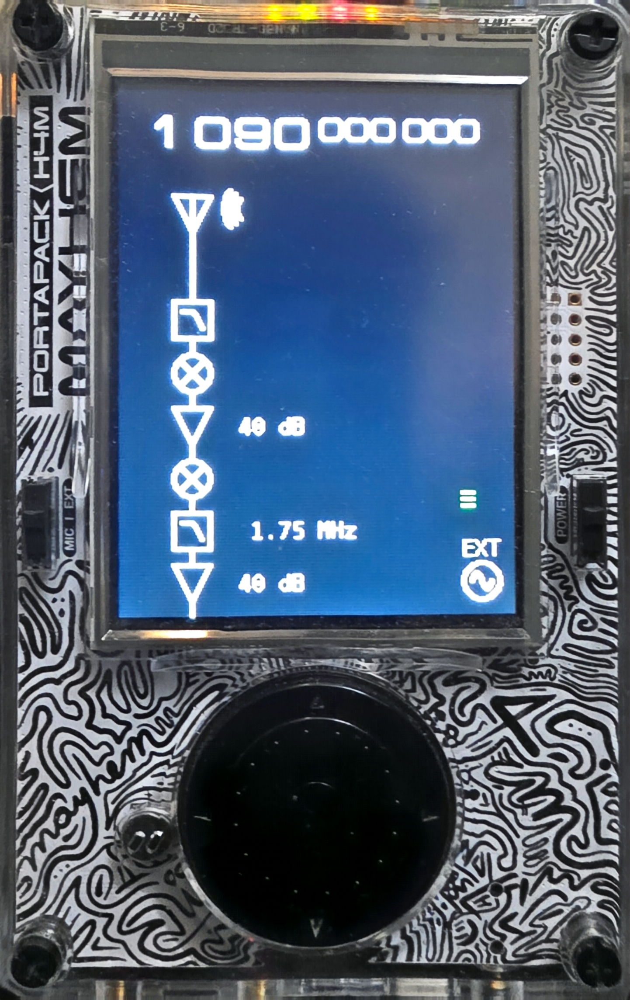
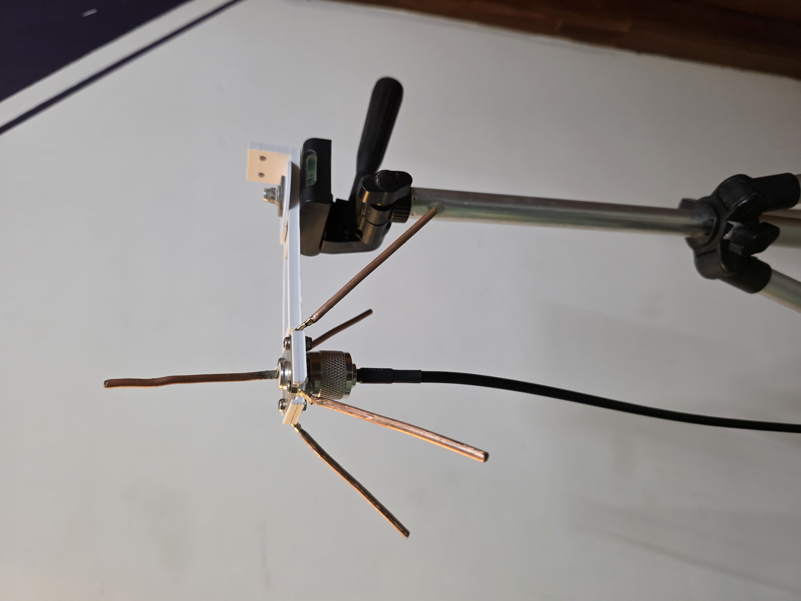

# ADS-B Receiver (HackRF & RTL-SDR / SoapySDR)

Decode live 1090 MHz Mode-S / ADS-B frames from a HackRF One or RTL-SDR dongle and watch a live
aircraft list. Written in Python (3.12), tested on Windows 11 with
[radioconda](https://github.com/radio-toolchain/radioconda).

```
# Default (HackRF):
python adsb_sdr.py

# Or RTL-SDR:
python adsb_sdr.py --device rtlsdr --gain 40
```

## Files

| File                   | Purpose                                                     |
| ---------------------- | ----------------------------------------------------------- |
| `adsb_sdr.py`          | Multi-SDR live receiver (HackRF & RTL-SDR, HackRF default)  |
| `adsb_hackrf.py`       | Original HackRF-specific live receiver + decoder            |
| `aircraft_list.py`     | Live table of aircraft, fed from the replay pipe            |
| `test_adsb.py`         | Unit/validation tests                                       |

## Requirements

- Windows (or Linux/macOS — sockets and numpy) with Python 3.12 in the
  **radioconda** base environment, which bundles:
  - `numpy`
  - SoapySDR Python bindings and the HackRF SoapySDR plugin
- A HackRF One with the libusb driver installed (see radioconda's
  `SoapyHackRF` package; on Windows, Zadig for the USB driver)

Activate and verify:

```
conda activate radioconda
python -c "import SoapySDR, numpy; print(SoapySDR.getHardwareInfo() if hasattr(SoapySDR,'getHardwareInfo') else 'ok')"
```

## Live receive

Run from the project folder:

```
python adsb_hackrf.py
```

Decoded frames stream to stdout; one line per frame:

```
*8D8017295877D6CC74DFD7E73403; DF17  801729  TC11  ALT=22925ft
*8D80172999158C0CD0643128E66A; DF17  801729  TC19  SPD=407GS  TRK=284.3  VR=1536ftm
```

`Ctrl-C` stops. Traffic can be sparse — planes pass in bursts.

### Options & Multi-SDR Usage

```bash
# HackRF (default device)
python adsb_sdr.py --freq 1090 --rate 2000000 --lna 40 --vga 40 --amp 0

# RTL-SDR dongle with Dual AGC (Tuner AGC + RTL2832 Digital AGC) and DC Block:
python adsb_sdr.py --device rtlsdr --agc

# RTL-SDR dongle with manual max gain (e.g. 49.6 dB):
python adsb_sdr.py --device rtlsdr --gain 49.6 --ppm 0

# RTL-SDR with active antenna LNA via Bias-Tee:
python adsb_sdr.py --device rtlsdr --agc --biastee

# Auto-detect SDR (checks HackRF first, then RTL-SDR):
python adsb_sdr.py --device auto

# General options
python adsb_sdr.py --seconds 600              # auto-stop after 10 min
python adsb_sdr.py --stats                    # signal stats on stderr every 5 s
python adsb_sdr.py --lat 10.37 --lon 77.19    # enable ground-surface CPR fixes
python adsb_sdr.py --save-raw captures        # record raw I/Q while live
```

Defaults: 1090 MHz, 2 MS/s.
- **HackRF**: LNA=40 dB, VGA=40 dB, AMP=0 dB. Do **not** enable the HackRF preamp (`--amp 1`), it saturates the ADC.
- **RTL-SDR**:
  - `--agc`: Enables both **Tuner AGC** and **RTL2832 Digital AGC** (recommended for variable signal conditions).
  - `--gain <dB>`: Sets manual tuner gain (0 to 49.6 dB).
  - Software DC blocker (`--no-dc-block` to disable) and hardware offset tuning (`--no-offset-tune` to disable) are active by default to prevent zero-Hz carrier leakage.
  - `--biastee`: Powers active antenna preamplifiers via the RTL-SDR / HackRF coax.

## Aircraft list

Pipe the receiver's stdout into the list view (works best in Windows Terminal):

```
python adsb_hackrf.py | python aircraft_list.py
```

Redraws once per second, most recent hits on top:

```
 ADS-B 1090 MHz   aircraft: 2   frames: 9
ID      CALL     AGE       ALT       SPD      TRK    VR     POS               MSG
--------------------------------------------------------------------------
801729  -        4 s       23800ft   408GS    284.0  1664ftm 10.38258,77.14721 7
406B90  EZY85MH  5 s       -         -        -      -      -                 2
```

Replay a recorded file into the same list:

```
python adsb_hackrf.py --from-raw captures/iq_20260817_204028.c16 | python aircraft_list.py
```

## Raw capture & replay

Raw files are interleaved `int16` I/Q, little-endian, 16-byte header carrying
the sample rate (replay sets the rate automatically):

```
python adsb_hackrf.py --save-raw captures
python adsb_hackrf.py --from-raw captures/iq_20260817_204028.c16
```

Disk usage: ~8 MB/s at 2 MS/s (adjust `--rate` if needed).

## Tests

```
python test_adsb.py
```

## Screenshot

HackRF One while receiving frames from this receiver:



### Antenna

1090 MHz ground plane antenna used with this setup:



3D-printed antenna mount: https://www.thingiverse.com/thing:4757813